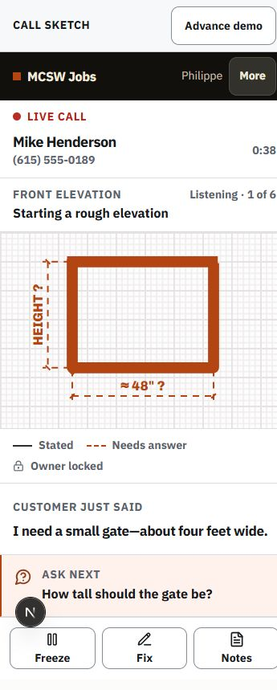
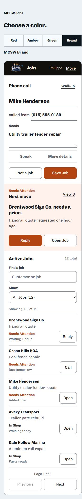
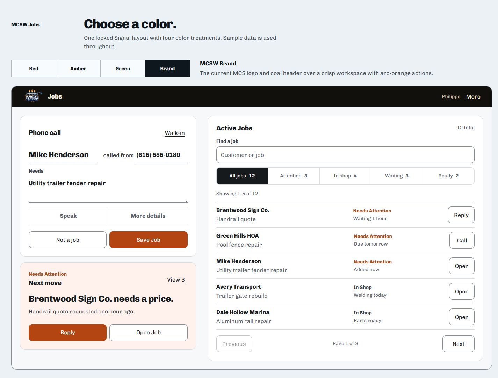
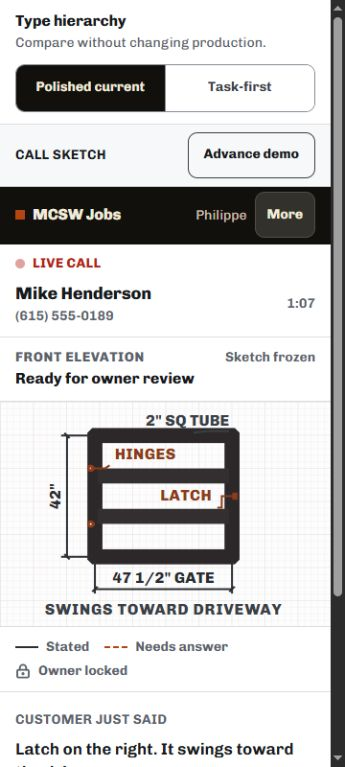
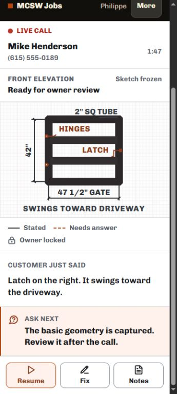
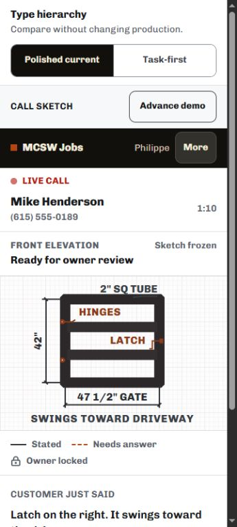
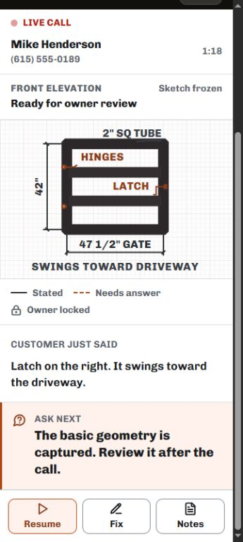

# CRM visual polish evidence — 2026-08-11

This pass preserves the locked Signal structure, Chivo typeface, MCSW red-rust palette, workflow, navigation, data, and customer-facing meaning. It changes only optical execution across `/ops`, Call Sketch, and `/j/[token]`. The public homepage and marketing routes are excluded.

## Rollback point

- Clean baseline commit: `c777bc2` (`feat(ops): add Call Sketch launcher`)
- Branch at baseline: `agent/app-call-sketch`
- Visual foundation checkpoint: `916433e` (`style(ops): refine visual foundation`)
- Call Sketch checkpoint: `ef62c61` (`style(call-sketch): sharpen visual hierarchy`)
- The polish is split so either checkpoint can be reverted independently.
- No database migration, schema change, provider flag, workflow change, or deployment is included.

## Before

### Call Sketch at 360px

### Locked CRM system reference

## After — production default

The production default remains **Polished current**.

## Optional hierarchy comparison

The task-first setting exists only on `/design-preview/mcsw-jobs-call-sketch`; it does not alter production.

| Treatment | Active question | Weight | Result in this Moto-width example |
| --- | ---: | ---: | --- |
| Polished current | 17px | 720 | Two lines; quieter and denser |
| Task-first | 19px | 780 | Three lines; clearer priority, more vertical space |

## Locked optical contract

- One visible product face: Chivo variable.
- 14px minimum meaningful text; 16px product body baseline.
- Natural tracking for names, customer words, questions, and controls; heading tightening limited to `-0.008em` or `-0.012em`.
- Body 450, labels 650, controls 680, headings 760, strongest names/display moments 780.
- Lucide only, on a 16/18/20px optical scale with `1.875` stroke and non-scaling paths.
- 48px primary controls; 44px compact secondary floor.
- Existing paper, coal, and welding red-rust (`#b34513`) relationships; subtle depth only where it clarifies layering.
- Safe-area-aware `/ops` and Customer Page viewports for installed PWA and Chrome fallback.

## Verification evidence

- Responsive render: pass at 320, 360, 375, 390, 414, 768, 1280, and 1440 CSS pixels.
- Landscape render: pass at 720×360 and 800×360.
- 125% Moto display-size proxy: pass at an effective 288×640 CSS-pixel viewport.
- Minimum rendered text: 14px at every tested default viewport.
- Interactive controls: none below 44px; primary controls render at 48px or 52px.
- Horizontal overflow: none at any tested viewport.
- Squeezed tracking (`≤ -0.5px` computed): none.
- Keyboard focus: 3px immediate focus ring with 3px offset.
- Core WCAG contrast: 5.56:1 minimum among the tested ink, muted, red-rust, header, and danger pairs.
- Typecheck: pass.
- ESLint: pass.
- Shop Brain regression suite: 149/149 pass.
- Optimized Next.js build: pass; the existing Atkinson fallback-font warning remains unrelated.

## Physical signoff still required

Browser evidence is provisional. Before calling the pass final on hardware, verify the installed PWA and Chrome fallback on the owner's Motorola Moto G (2026), record its actual CSS viewport, and check default plus one enlarged Android text/display setting with gesture navigation and the keyboard open.
